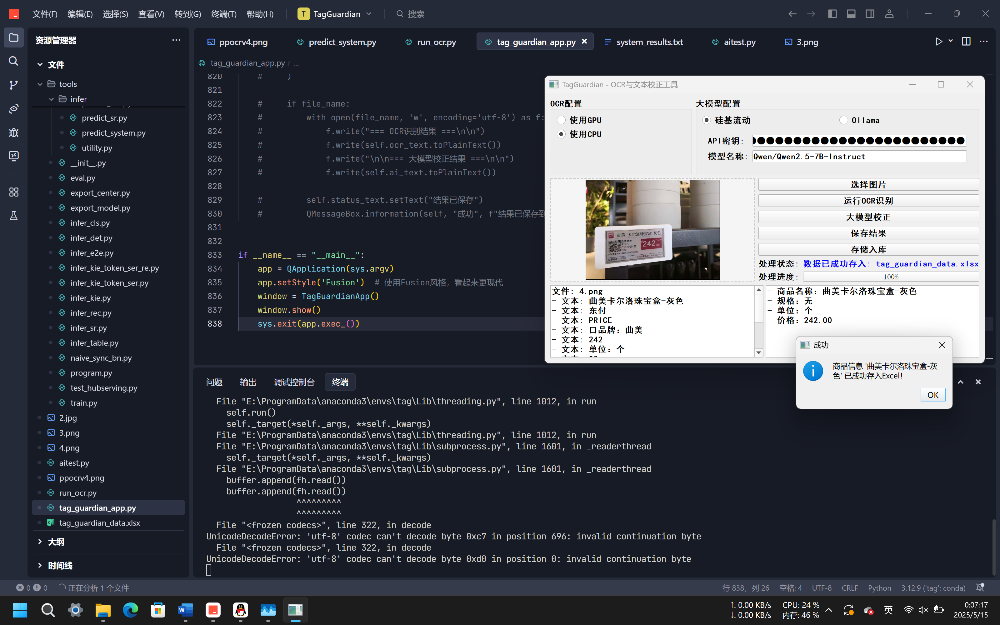

# TagGuardian - 基于飞桨PaddleOCR与大模型校正的商超价签提取工具

## 项目简介

TagGuardian（价签哨兵）是一款基于飞桨PaddleOCR与大模型校正的商超价签信息提取工具。本工具能够快速识别商品价签上的文字信息，并通过大模型进行智能校正和结构化提取，帮助用户高效获取商品名称、规格、单位和价格等关键信息。

## 功能特点

- **高精度OCR识别**：基于飞桨PaddleOCR的文字识别能力，支持多种复杂场景下的价签识别
- **大模型智能校正**：集成大模型API（支持硅基流动和本地Ollama），对OCR结果进行智能校正和结构化提取
- **友好的图形界面**：基于PyQt5开发的直观操作界面，支持图片预览、结果展示和批量处理
- **数据导出功能**：支持将提取结果导出为Excel表格，方便后续数据分析和管理
- **灵活的配置选项**：支持自定义OCR模型路径、大模型API设置等，满足不同场景需求
- 

## 安装依赖

```bash
pip install -r requirements.txt
```

主要依赖包括：
- PyQt5：图形界面库
- opencv-python：图像处理
- openai：大模型API调用
- openpyxl：Excel文件处理
- requests：HTTP请求库

## 使用方法

1. 克隆或下载本仓库到本地
2. 安装所需依赖：`pip install -r requirements.txt`
3. 运行主程序：`python tag_guardian_app.py`
4. 在界面中选择价签图片，点击"开始识别"
5. 查看OCR识别结果和大模型校正后的结构化信息
6. 可选择导出结果到Excel文件

## 项目结构

```
TagGuardian/
├── tag_guardian_app.py      # 主程序入口
├── requirements.txt         # 依赖包列表
├── run_ocr.py               # OCR调用脚本
├── aitest.py                # 大模型测试脚本
├── ch_PP-OCRv4_det_infer/   # OCR检测模型目录
├── ch_PP-OCRv4_rec_infer/   # OCR识别模型目录
├── ppocr/                   # PaddleOCR核心库
├── tools/                   # PaddleOCR工具脚本
└── inference_results/       # 识别结果输出目录
```

## 配置说明

### OCR模型配置
- 默认使用PaddleOCR v4中文模型
- 可在界面中自定义检测模型和识别模型路径
- 支持开启/关闭文本方向分类器
- 支持GPU加速（需安装CUDA环境）

### 大模型配置
- 支持硅基流动API和本地Ollama两种模式
- 硅基流动模式需配置API Key和模型名称
- Ollama模式需配置服务地址和模型名称

## 常见问题

1. **OCR识别不准确？**
   - 尝试调整图片亮度和对比度
   - 确保价签图片清晰，避免严重模糊、反光或阴影

2. **大模型校正失败？**
   - 检查网络连接和API配置
   - 尝试使用不同的大模型

3. **程序运行缓慢？**
   - 考虑开启GPU加速（需CUDA环境）
   - 减小处理图片的分辨率

## 贡献指南

欢迎提交Issue和Pull Request来帮助改进本项目。贡献前请先fork本仓库，然后创建自己的分支进行开发，完成后提交PR。

## 许可证

本项目基于Apache 2.0许可证开源。详情请参阅LICENSE文件。

## 致谢

- [PaddleOCR](https://github.com/PaddlePaddle/PaddleOCR)：提供强大的OCR能力
- [PyQt5](https://www.riverbankcomputing.com/software/pyqt/)：提供GUI开发框架
- 所有为本项目做出贡献的开发者

## 联系方式

如有任何问题或建议，欢迎通过Issues与我们联系。

---

**注意**：本工具仅用于辅助信息提取，实际应用中请以商品实际标签为准。使用大模型API时请遵守相关服务提供商的使用条款。
